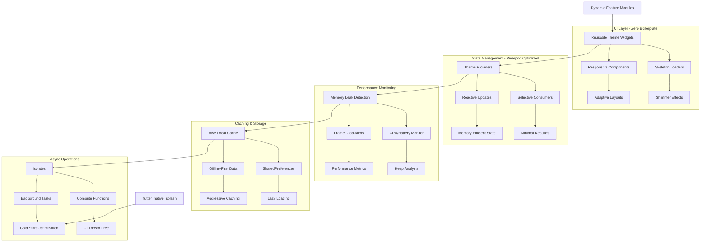
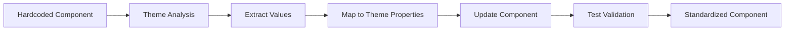

# Design Document

## Overview

This design outlines a comprehensive theme standardization system for the BabyFace Flutter application that follows industry-level best practices. The system will eliminate hardcoded colors and text styles, establish consistent theming with light/dark mode support, implement universal responsiveness, add bouncing scroll behavior, and fix test issues. The design emphasizes minimal code, zero boilerplate, reusable widgets, loose coupling, optimized performance, memory management, and follows Flutter's recommended architecture patterns with Riverpod state management.

## Architecture

### Super-Optimized Flutter App Architecture



### Component Standardization Flow



## Components and Interfaces

### 1. Zero-Boilerplate Theme System

#### Riverpod-Powered Theme Providers
```dart
@riverpod
class ThemeNotifier extends _$ThemeNotifier {
  @override
  AppThemeData build() => AppThemeData.light();
  
  void toggleTheme() => state = state.isDark 
    ? AppThemeData.light() 
    : AppThemeData.dark();
}

@riverpod
ResponsiveBreakpoint currentBreakpoint(CurrentBreakpointRef ref) {
  return ref.watch(screenSizeProvider.select((size) => 
    ResponsiveUtils.getBreakpoint(size.width)));
}
```

#### Memory-Efficient Theme Extensions
```dart
extension OptimizedThemeContext on BuildContext {
  // Cached theme access - prevents repeated lookups
  AppThemeData get theme => _themeCache ??= AppTheme.of(this);
  
  // Selective color access - only rebuilds when colors change
  ColorScheme get colors => select((AppThemeData theme) => theme.colors);
  
  // Responsive utilities with caching
  ResponsiveUtils get responsive => _responsiveCache ??= ResponsiveUtils.of(this);
}
```

#### Reusable Widget Base Classes
```dart
abstract class OptimizedWidget extends ConsumerWidget {
  const OptimizedWidget({super.key});
  
  @override
  Widget build(BuildContext context, WidgetRef ref) {
    return _buildWithPerformanceTracking(context, ref);
  }
  
  Widget buildOptimized(BuildContext context, WidgetRef ref);
  
  Widget _buildWithPerformanceTracking(BuildContext context, WidgetRef ref) {
    return PerformanceTracker.wrap(
      name: runtimeType.toString(),
      child: buildOptimized(context, ref),
    );
  }
}
```

### 2. Performance-Optimized Scroll System

#### Memory-Efficient Scroll Behavior
```dart
class OptimizedBabyScrollBehavior extends ScrollBehavior {
  @override
  ScrollPhysics getScrollPhysics(BuildContext context) {
    // Cached physics to prevent object recreation
    return _cachedPhysics ??= const BouncingScrollPhysics(
      parent: AlwaysScrollableScrollPhysics(),
    );
  }
  
  @override
  Widget buildScrollbar(context, child, details) {
    // Lazy-loaded scrollbar with theme integration
    return ref.watch(themeProvider.select((theme) => theme.scrollbarTheme))
        .buildScrollbar(context, child, details);
  }
}
```

#### Lazy Loading Scroll Components
```dart
class LazyScrollView extends OptimizedWidget {
  @override
  Widget buildOptimized(BuildContext context, WidgetRef ref) {
    return ListView.builder(
      physics: ref.watch(optimizedScrollPhysicsProvider),
      itemBuilder: (context, index) => LazyItemBuilder(
        index: index,
        builder: (context) => _buildItem(context, index),
      ),
    );
  }
}
```

### 3. Modular Component Architecture

#### Dynamic Feature Modules
```dart
// Deferred loading for theme components
@DeferredLibrary('theme_components')
import 'package:future_baby/features/theme/components.dart' deferred as theme_components;

class DynamicThemeLoader {
  static Future<Widget> loadThemeComponent(String componentName) async {
    await theme_components.loadLibrary();
    return theme_components.createComponent(componentName);
  }
}
```

#### Skeleton Loading Components
```dart
class SkeletonThemeCard extends OptimizedWidget {
  @override
  Widget buildOptimized(BuildContext context, WidgetRef ref) {
    final isLoading = ref.watch(themeLoadingProvider);
    
    return AnimatedSwitcher(
      duration: AppTheme.fastAnimation,
      child: isLoading 
        ? ShimmerSkeleton(
            child: Container(
              decoration: ref.watch(skeletonDecorationProvider),
            ),
          )
        : ActualThemeCard(),
    );
  }
}
```

#### Loose Coupling with Dependency Injection
```dart
@riverpod
ThemeRepository themeRepository(ThemeRepositoryRef ref) {
  return ThemeRepositoryImpl(
    localCache: ref.watch(hiveThemeCacheProvider),
    remoteApi: ref.watch(themeApiProvider),
    performanceMonitor: ref.watch(performanceMonitorProvider),
  );
}
```

### 4. Aggressive Caching & Storage System

#### Hive-Powered Theme Caching
```dart
@riverpod
class ThemeCacheNotifier extends _$ThemeCacheNotifier {
  late Box<ThemeData> _themeBox;
  
  @override
  Future<CachedTheme> build() async {
    _themeBox = await Hive.openBox<ThemeData>('theme_cache');
    return _loadCachedTheme();
  }
  
  Future<void> cacheTheme(ThemeData theme) async {
    await _themeBox.put('current_theme', theme);
    // Aggressive caching - preload related themes
    await _preloadRelatedThemes(theme);
  }
}
```

#### Offline-First Theme Storage
```dart
class OfflineThemeRepository {
  final HiveInterface _hive;
  final SharedPreferences _prefs;
  
  Future<ThemeData> getTheme() async {
    // Try cache first, fallback to network
    final cached = await _getCachedTheme();
    if (cached != null) return cached;
    
    return await _fetchAndCacheTheme();
  }
  
  Future<void> _preloadThemes() async {
    // Background isolate for theme preloading
    await compute(_preloadThemesInIsolate, _getThemeUrls());
  }
}
```

#### Memory-Efficient Responsive System
```dart
@riverpod
class ResponsiveNotifier extends _$ResponsiveNotifier {
  Timer? _debounceTimer;
  
  @override
  ResponsiveData build() {
    return ResponsiveData.fromMediaQuery();
  }
  
  void updateScreenSize(Size size) {
    // Debounce rapid size changes to prevent excessive rebuilds
    _debounceTimer?.cancel();
    _debounceTimer = Timer(const Duration(milliseconds: 100), () {
      state = ResponsiveData.fromSize(size);
    });
  }
}
```

### 5. Asynchronous Performance System

#### Isolate-Powered Theme Processing
```dart
class ThemeIsolateManager {
  static Future<ProcessedTheme> processThemeInBackground(
    RawThemeData rawTheme,
  ) async {
    return await compute(_processThemeIsolate, rawTheme);
  }
  
  static ProcessedTheme _processThemeIsolate(RawThemeData rawTheme) {
    // Heavy theme calculations in isolate
    return ProcessedTheme(
      colors: _calculateColors(rawTheme),
      typography: _calculateTypography(rawTheme),
      responsive: _calculateResponsive(rawTheme),
    );
  }
}
```

#### Cold Start Optimization
```dart
class AppInitializer {
  static Future<void> initializeAsync() async {
    // Show splash immediately
    await _showNativeSplash();
    
    // Initialize critical services in parallel
    await Future.wait([
      _initializeHive(),
      _initializeThemeCache(),
      _preloadCriticalAssets(),
      _initializePerformanceMonitoring(),
    ]);
    
    // Background initialization
    unawaited(_initializeNonCriticalServices());
  }
}
```

#### Memory Leak Prevention
```dart
class MemoryAwareThemeWidget extends OptimizedWidget {
  @override
  Widget buildOptimized(BuildContext context, WidgetRef ref) {
    // Automatic cleanup on dispose
    ref.onDispose(() {
      _cleanupResources();
      MemoryMonitor.reportWidgetDisposed(runtimeType);
    });
    
    return ref.watch(themeProvider.select((theme) => 
      _buildWithMemoryTracking(context, theme)
    ));
  }
  
  void _cleanupResources() {
    // Cleanup listeners, controllers, etc.
    _animationController?.dispose();
    _streamSubscription?.cancel();
  }
}
```

## Data Models

### Performance-Optimized Theme Models
```dart
@freezed
class OptimizedThemeConfig with _$OptimizedThemeConfig {
  const factory OptimizedThemeConfig({
    required CachedColorPalette colors,
    required LazyTypographyConfig typography,
    required ResponsiveConfig responsive,
    required PerformanceConfig performance,
    @Default(null) MemoryMetrics? memoryMetrics,
  }) = _OptimizedThemeConfig;
  
  factory OptimizedThemeConfig.fromJson(Map<String, dynamic> json) =>
      _$OptimizedThemeConfigFromJson(json);
}

@HiveType(typeId: 1)
class CachedColorPalette extends HiveObject {
  @HiveField(0)
  final Map<String, int> colorValues;
  
  @HiveField(1)
  final DateTime cacheTime;
  
  @HiveField(2)
  final String version;
  
  // Lazy color computation
  Color getColor(String key) => _colorCache[key] ??= Color(colorValues[key]!);
}

@riverpod
class PerformanceMetrics extends _$PerformanceMetrics {
  @override
  PerformanceData build() => const PerformanceData();
  
  void trackMemoryUsage(String component, int bytes) {
    state = state.copyWith(
      memoryUsage: {...state.memoryUsage, component: bytes},
    );
  }
  
  void trackFrameTime(Duration frameTime) {
    if (frameTime > const Duration(milliseconds: 16)) {
      _alertFrameDrop(frameTime);
    }
  }
}
```

### Minimal Data Models
```dart
@freezed
class ResponsiveBreakpoint with _$ResponsiveBreakpoint {
  const factory ResponsiveBreakpoint({
    required double width,
    required DeviceType type,
    @Default(1.0) double scaleFactor,
  }) = _ResponsiveBreakpoint;
}

@freezed
class ThemeMetrics with _$ThemeMetrics {
  const factory ThemeMetrics({
    @Default(0) int rebuildCount,
    @Default(Duration.zero) Duration lastRebuildTime,
    @Default(0) int memoryUsage,
    @Default(false) bool hasMemoryLeaks,
  }) = _ThemeMetrics;
}
```

## Error Handling & Performance Monitoring

### Memory Leak Detection System
```dart
class MemoryLeakDetector {
  static final Map<String, WeakReference<Object>> _trackedObjects = {};
  
  static void trackObject(String id, Object object) {
    _trackedObjects[id] = WeakReference(object);
    
    // Schedule cleanup check
    Timer.periodic(const Duration(minutes: 1), (_) => _checkForLeaks());
  }
  
  static void _checkForLeaks() {
    final leakedObjects = _trackedObjects.entries
        .where((entry) => entry.value.target == null)
        .map((entry) => entry.key)
        .toList();
    
    if (leakedObjects.isNotEmpty) {
      PerformanceMonitor.reportMemoryLeaks(leakedObjects);
    }
  }
}
```

### CPU & Battery Monitoring
```dart
@riverpod
class PerformanceMonitor extends _$PerformanceMonitor {
  Timer? _monitoringTimer;
  
  @override
  PerformanceData build() {
    _startMonitoring();
    return const PerformanceData();
  }
  
  void _startMonitoring() {
    _monitoringTimer = Timer.periodic(
      const Duration(seconds: 1),
      (_) => _collectMetrics(),
    );
  }
  
  void _collectMetrics() {
    final metrics = PerformanceMetrics.current();
    
    if (metrics.cpuUsage > 80) {
      _alertHighCPUUsage(metrics.cpuUsage);
    }
    
    if (metrics.memoryUsage > 500 * 1024 * 1024) { // 500MB
      _alertHighMemoryUsage(metrics.memoryUsage);
    }
  }
}
```

### Proactive Error Prevention
```dart
class ThemeErrorBoundary extends ConsumerWidget {
  @override
  Widget build(BuildContext context, WidgetRef ref) {
    return ref.watch(themeProvider).when(
      data: (theme) => _buildWithTheme(context, theme),
      loading: () => const SkeletonLoader(),
      error: (error, stack) => _buildFallbackTheme(context, error),
    );
  }
  
  Widget _buildFallbackTheme(BuildContext context, Object error) {
    // Log error for monitoring
    ErrorReporter.reportThemeError(error);
    
    // Return minimal fallback theme
    return MaterialApp(
      theme: AppTheme.fallbackTheme,
      home: const ErrorRecoveryScreen(),
    );
  }
}
```

## Testing Strategy

### Unit Testing
- **Theme Property Tests**: Validate all theme properties return expected values
- **Responsive Calculation Tests**: Test responsive utilities across different screen sizes
- **Color Contrast Tests**: Ensure accessibility compliance for all color combinations
- **Typography Tests**: Validate font loading and text style calculations

### Widget Testing
- **Theme Integration Tests**: Test components with both light and dark themes
- **Responsive Layout Tests**: Validate component behavior across device types
- **Animation Tests**: Test theme-based animations and transitions
- **Scroll Behavior Tests**: Validate universal scroll physics implementation

### Integration Testing
- **Theme Switching Tests**: Test seamless theme transitions in running app
- **Performance Tests**: Measure theme calculation and application performance
- **Accessibility Tests**: Validate theme compliance with accessibility standards
- **Cross-Platform Tests**: Ensure consistent behavior across iOS and Android

### Test Infrastructure Improvements
- **Enhanced Test Setup**: Proper theme initialization for all widget tests
- **Mock Responsive Environment**: Simulate different screen sizes in tests
- **Theme Test Utilities**: Helper functions for common theme testing scenarios
- **Automated Visual Testing**: Screenshot comparison for theme consistency

## Implementation Phases

### Phase 1: Performance Foundation & Riverpod Setup
1. Implement Riverpod providers for theme management with selective rebuilds
2. Set up Hive caching system for aggressive local storage
3. Create memory leak detection and performance monitoring infrastructure
4. Implement flutter_native_splash for cold start optimization
5. Set up isolate-based background processing for theme calculations

### Phase 2: Zero-Boilerplate Component Architecture
1. Create OptimizedWidget base class with automatic performance tracking
2. Implement skeleton loading system with shimmer effects
3. Refactor ResponsiveButton with memory-efficient state management
4. Create deferred loading system for dynamic feature modules
5. Implement universal scroll physics with bouncing behavior

### Phase 3: Aggressive Caching & Offline-First
1. Implement multi-layer caching (memory → Hive → SharedPreferences)
2. Create lazy loading system for theme components
3. Set up background preloading of critical theme assets
4. Implement offline-first theme repository with fallback strategies
5. Add automatic cache invalidation and cleanup mechanisms

### Phase 4: Memory Management & Leak Prevention
1. Implement automatic resource cleanup in widget lifecycle
2. Add WeakReference tracking for theme-related objects
3. Create memory usage monitoring and alerting system
4. Implement CPU and battery usage tracking
5. Add frame drop detection and automatic complexity reduction

### Phase 5: Testing & Performance Validation
1. Fix ResponsiveButton tests with proper Riverpod test setup
2. Implement performance benchmarking for theme operations
3. Add memory leak detection in test environment
4. Create automated performance regression testing
5. Validate frame rate consistency across different devices

### Phase 6: Production Optimization
1. Implement dynamic feature module loading for reduced APK size
2. Add production performance monitoring and crash reporting
3. Optimize theme bundle size and loading strategies
4. Implement A/B testing for theme performance variations
5. Create performance dashboard for monitoring theme metrics

## Performance Optimization Strategy

### Lazy Loading & Deferred Components
```dart
class DeferredThemeComponents {
  static const Map<String, String> _deferredLibraries = {
    'advanced_themes': 'package:future_baby/themes/advanced.dart',
    'animations': 'package:future_baby/themes/animations.dart',
    'custom_widgets': 'package:future_baby/widgets/custom.dart',
  };
  
  static Future<T> loadComponent<T>(String libraryName) async {
    final library = _deferredLibraries[libraryName];
    await loadLibrary(library!);
    return getComponent<T>(libraryName);
  }
}
```

### Aggressive Caching Strategy
```dart
class ThemeCache {
  static final Map<String, dynamic> _memoryCache = {};
  static late Box _persistentCache;
  
  static Future<void> initialize() async {
    _persistentCache = await Hive.openBox('theme_cache');
    
    // Preload frequently used themes
    await _preloadCriticalThemes();
  }
  
  static T? get<T>(String key) {
    // Memory cache first (fastest)
    if (_memoryCache.containsKey(key)) {
      return _memoryCache[key] as T;
    }
    
    // Persistent cache second
    final cached = _persistentCache.get(key);
    if (cached != null) {
      _memoryCache[key] = cached; // Promote to memory cache
      return cached as T;
    }
    
    return null;
  }
}
```

### Frame Drop Prevention
```dart
class SmoothThemeTransitions {
  static Widget buildWithFrameTracking(
    Widget child,
    String componentName,
  ) {
    return FrameTracker(
      name: componentName,
      onFrameDrop: (duration) => _handleFrameDrop(componentName, duration),
      child: child,
    );
  }
  
  static void _handleFrameDrop(String component, Duration frameTime) {
    if (frameTime > const Duration(milliseconds: 16)) {
      // Reduce animation complexity
      AnimationComplexityManager.reduceComplexity(component);
      
      // Report performance issue
      PerformanceReporter.reportFrameDrop(component, frameTime);
    }
  }
}
```

## Accessibility Integration

### Color Accessibility
- **Contrast Validation**: Automatic contrast ratio checking
- **Color Blind Support**: Alternative visual indicators beyond color
- **High Contrast Mode**: Enhanced theme for accessibility needs
- **System Theme Integration**: Respect system accessibility preferences

### Typography Accessibility
- **Dynamic Type Support**: Respect system font size preferences
- **Reading Accessibility**: Optimized line heights and spacing
- **Font Weight Accessibility**: Appropriate font weights for readability
- **Language Support**: Proper font fallbacks for different languages

## Migration Strategy

### Gradual Migration Approach
1. **Identify Components**: Audit all components for hardcoded values
2. **Prioritize by Impact**: Focus on most-used components first
3. **Incremental Updates**: Update components one at a time
4. **Validation Testing**: Test each component after migration
5. **Documentation Updates**: Update component documentation

### Developer Guidelines
- **Theme Usage Patterns**: Established patterns for accessing theme properties
- **Code Review Checklist**: Ensure new code follows theme standards
- **Migration Tools**: Scripts to help identify hardcoded values
- **Training Materials**: Documentation and examples for developers